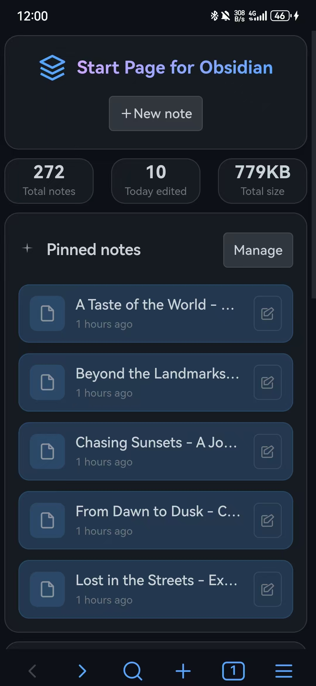
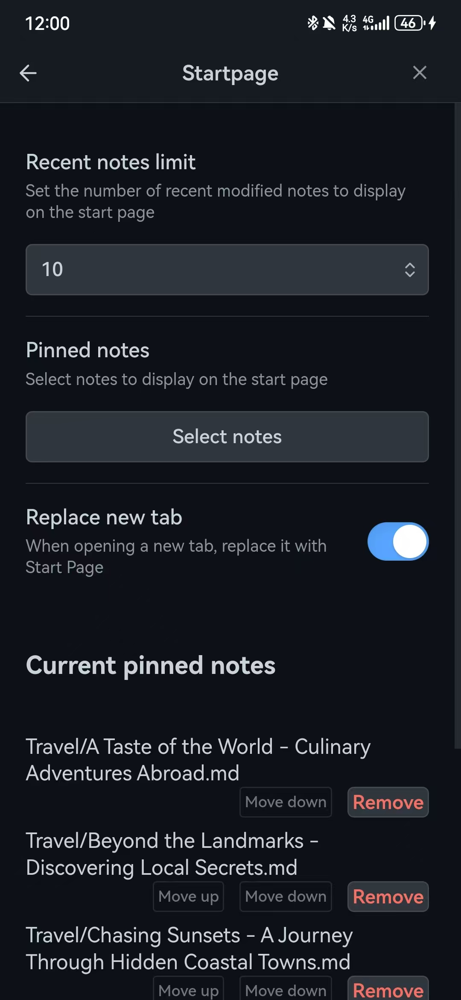

# StartPage 插件

[English](README.md) | 中文

> ⚠️ 重要提示
> 我发现了一个用途跟 `StartPage` 一样，但功能更强大的插件：[Notebook Navigator](https://github.com/johansan/notebook-navigator)，鉴于它已经做的如此优秀了，因此我决定停止 `StartPage` 的开发，后续将不再更新，特此说明。

一个为 Obsidian 设计的现代化启动首页插件，提供美观的仪表板界面，展示笔记库统计信息、置顶笔记和最近修改的笔记。当启动 Obsidian 或打开新标签页时，自动显示个性化的首页，让您快速访问重要内容。

## ✨ 功能特性

### 🏠 智能首页
- **自动启动首页**: 插件启动时自动打开自定义首页，支持替换新标签页功能
- **现代化设计**: 采用卡片式布局，支持响应式设计，完美适配各种屏幕尺寸
- **仪表板统计**: 实时显示笔记库统计信息（总笔记数、今日编辑数、总占用空间）
- **快速操作**: 内置新建笔记按钮，一键创建新笔记
- **工具栏集成**: 在左侧工具栏添加首页图标，随时快速访问

### 📌 笔记管理
- **置顶笔记**: 可以设置重要的笔记在首页置顶显示，支持快速访问
- **最近笔记**: 显示最近修改的笔记列表，按修改时间排序
- **智能搜索**: 支持模糊搜索选择置顶笔记
- **动态数量**: 可自定义最近笔记显示数量（5-50个）
- **右键菜单**: 支持在文件右键菜单中添加/移除置顶笔记

### 🎨 用户体验
- **智能时间显示**: 自动显示相对时间（几分钟前、几小时前、几天前）
- **多语言支持**: 支持中文和英文界面，可动态切换
- **实时刷新**: 文件变更时自动刷新首页内容
- **定时更新**: 24小时内的笔记会启动定时刷新（每分钟）
- **右键菜单**: 支持右键刷新功能
- **主题适配**: 完美适配 Obsidian 的明暗主题

## 🚀 安装

### 从 Obsidian 社区插件安装

1. 打开 Obsidian 设置
2. 进入"社区插件"选项卡
3. 关闭"安全模式"
4. 点击"浏览"按钮
5. 搜索"StartPage"
6. 点击安装并启用插件

### 手动安装

1. 从 [Releases](https://github.com/kuzzh/obsidian-startpage/releases) 下载最新版本的插件文件
2. 在你的 Obsidian 库中创建 `.obsidian/plugins/obsidian-startpage/` 文件夹
3. 将下载的 `main.js`、`styles.css`、`manifest.json` 文件复制到该文件夹中
4. 重启 Obsidian
5. 在设置 → 社区插件中启用 "Startpage" 插件

## 📷 界面截图

### 桌面端界面

#### 浅色主题

*桌面端浅色主题下的 StartPage 界面*


*浅色主题下的插件设置界面*

#### 深色主题

*桌面端深色主题下的 StartPage 界面*


*深色主题下的插件设置界面*

### 移动端界面

#### 浅色主题

*移动端浅色主题下的 StartPage 界面*


*移动端浅色主题下的插件设置界面*

#### 深色主题

*移动端深色主题下的 StartPage 界面*


*移动端深色主题下的插件设置界面*

## 📖 使用方法

### 基本使用

1. **启动首页**: 安装并启用插件后，可以通过以下方式打开启动首页：
   - 点击左侧工具栏的"🏠"图标
   - 如果启用了"替换新标签页"功能，打开新标签页时会自动显示
2. **查看统计**: 首页顶部显示笔记库的统计信息（总笔记数、今日编辑数、总占用空间）
3. **快速新建**: 点击右上角的"新建笔记"按钮快速创建新笔记
4. **访问笔记**: 点击置顶笔记或最近笔记可以直接打开对应的笔记
5. **右键操作**: 在文件浏览器中右键点击文件，可以快速添加或移除置顶笔记

### 设置置顶笔记

1. 打开 Obsidian 设置
2. 找到"StartPage"设置选项卡
3. 点击"选择笔记"按钮
4. 在弹出的搜索框中输入笔记名称进行模糊搜索
5. 选择要置顶的笔记，它会显示在首页的"📌置顶笔记"部分
6. 点击置顶笔记区域的"管理"按钮可以快速跳转到设置页面

### 自定义设置

- **语言设置**: 选择中文或英文界面，支持动态切换
- **最近笔记数量**: 在首页直接调整显示数量（5-50个），或在设置中修改
- **置顶笔记管理**: 在设置页面添加或移除置顶笔记
- **替换新标签页**: 可选择是否在打开新标签页时自动显示启动首页
- **实时预览**: 所有设置修改后会立即在首页生效

## 🛠️ 开发

### 环境要求

- Node.js 16.0 或更高版本
- Obsidian 0.15.0 或更高版本

### 开发设置

1. 克隆仓库到本地
2. 安装依赖：
   ```bash
   npm install
   ```
3. 启动开发模式：
   ```bash
   npm run dev
   ```
4. 将插件文件夹链接到你的 Obsidian 库的 `.obsidian/plugins/` 目录

### 构建

```bash
npm run build
```

## 📝 功能详解

### 🎯 仪表板统计

- **总笔记数**: 显示笔记库中所有 Markdown 文件的数量
- **今日编辑**: 统计今天修改过的笔记数量
- **总占用空间**: 显示所有笔记文件的总大小（自动格式化为 B/KB/MB/GB）
- **实时更新**: 统计数据会随着文件变化自动更新

### 📋 笔记展示

- **置顶笔记区域**:
  - 显示用户手动设置的重要笔记
  - 支持无限添加置顶笔记
  - 一键管理功能，快速跳转到设置页面
- **最近笔记区域**:
  - 按修改时间排序显示最近编辑的笔记
  - 支持动态调整显示数量（5-50个）
  - 智能时间显示（相对时间和绝对时间）

### 🔄 智能刷新机制

- **文件监听**: 自动监听文件的修改、创建、删除、重命名事件
- **定时刷新**: 24小时内修改的笔记会启动定时刷新（每分钟）
- **手动刷新**: 支持右键菜单手动刷新功能
- **性能优化**: 智能判断是否需要刷新，避免不必要的性能消耗

### 🌍 多语言支持

- **双语界面**: 完整支持中文和英文界面
- **动态切换**: 可在设置中实时切换语言，无需重启
- **本地化显示**: 时间格式、数字格式等完全本地化
- **扩展性**: 架构支持轻松添加更多语言

## 🎨 界面特色

### 现代化设计
- **卡片式布局**: 采用现代化的卡片设计，信息层次清晰
- **渐变效果**: 精美的渐变色彩和阴影效果
- **响应式设计**: 完美适配桌面端和移动端
- **主题兼容**: 自动适配 Obsidian 的明暗主题

### 交互体验
- **悬停效果**: 丰富的鼠标悬停动画效果
- **点击反馈**: 清晰的点击反馈和状态变化
- **键盘支持**: 完整的键盘导航支持
- **无障碍访问**: 遵循无障碍设计原则

## 🔧 技术特性

- **TypeScript 开发**: 使用 TypeScript 确保代码质量和类型安全
- **模块化架构**: 清晰的模块分离，便于维护和扩展
- **性能优化**: 智能缓存和懒加载，确保流畅体验
- **内存管理**: 自动清理定时器和事件监听器，避免内存泄漏

## 🤝 贡献

欢迎提交 Issue 和 Pull Request！

### 开发指南
1. Fork 本仓库
2. 创建功能分支 (`git checkout -b feature/AmazingFeature`)
3. 提交更改 (`git commit -m 'Add some AmazingFeature'`)
4. 推送到分支 (`git push origin feature/AmazingFeature`)
5. 打开 Pull Request

## 📄 许可证

MIT License - 详见 [LICENSE](LICENSE) 文件

## 🙏 致谢

- 感谢 Obsidian 团队提供的优秀插件API和开发框架
- 感谢所有贡献者和用户的反馈与支持

---

**❤️ Love what you love, and love what you do. ❤️**
