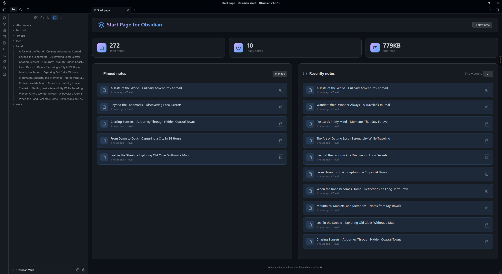

# StartPage Plugin

English | [中文](README.CN.md)

A modern startup homepage plugin for Obsidian that provides a beautiful dashboard interface, displaying vault statistics, pinned notes, and recently modified notes. Automatically displays a personalized homepage when starting Obsidian or opening new tabs, giving you quick access to important content.

## Features

### Smart Homepage
- **Automatic Startup Homepage**: Automatically replaces new tabs with the start page when enabled
- **Modern Design**: Card-based layout with responsive design, perfectly adapted to various screen sizes
- **Dashboard Statistics**: Real-time display of vault statistics (total notes, today's edits, total storage space)
- **Quick Search**: Built-in search box with keyboard shortcuts - just start typing to search your notes
- **Toolbar Integration**: Adds a homepage icon to the left toolbar for quick access anytime
- **Command Palette**: Access start page via commands ("Open start page" and "Open start page in new tab")

### Note Management
- **Pinned Notes**: Set important notes to be displayed at the top of the homepage for quick access
- **Recent Notes**: Display recently accessed and modified notes, intelligently sorted by both modification time and access time
- **Smart Search Modal**: Full-featured search with fuzzy matching and case-sensitive option
- **Dynamic Count**: Customizable number of recent notes to display (5-50 notes, adjustable directly on the homepage)
- **Context Menu**: Support adding/removing pinned notes via right-click context menu in file explorer and on pinned notes
- **Import from Bookmarks**: Easily import pinned notes from Obsidian's built-in bookmarks feature
- **Reorder Pinned Notes**: Move pinned notes up or down in the settings to customize the display order

### User Experience
- **Smart Time Display**: Automatically shows relative time (minutes ago, hours ago, days ago) for recent notes
- **Multi-language Support**: Automatically uses Obsidian's language setting (supports Chinese and English)
- **Real-time Refresh**: Automatically refreshes homepage content when files are modified, created, deleted, or renamed
- **Timed Updates**: Notes modified within 24 hours trigger periodic time display refresh (every minute)
- **Right-click Menu**: Supports right-click refresh functionality on the start page
- **Theme Adaptation**: Perfect adaptation to Obsidian's light and dark themes
- **Scroll Position Memory**: Remembers and restores your scroll position when returning to the start page
- **Keyboard Navigation**: Type any character while on the start page to instantly open search modal

## Installation

### Install from Obsidian Community Plugins

1. Open Obsidian Settings
2. Go to the "Community plugins" tab
3. Turn off "Safe mode"
4. Click the "Browse" button
5. Search for "StartPage"
6. Click install and enable the plugin

### Manual Installation

1. Download the latest version from the Releases page on GitHub.
2. Create a `.obsidian/plugins/obsidian-startpage/` folder in your Obsidian vault.
3. Copy the downloaded `main.js`, `styles.css`, and `manifest.json` files to this folder.
4. Restart Obsidian.
5. Enable the "Startpage" plugin in Settings → Community plugins.

## Screenshots

### Desktop Interface

#### Light Theme


*StartPage interface in light theme on desktop*


*Plugin settings interface in light theme*

#### Dark Theme


*StartPage interface in dark theme on desktop*


*Plugin settings interface in dark theme*

### Mobile Interface

#### Light Theme


*StartPage interface in light theme on mobile*


*Plugin settings interface in light theme on mobile*

#### Dark Theme


*StartPage interface in dark theme on mobile*


*Plugin settings interface in dark theme on mobile*

## Usage

### Basic Usage

1. **Open Start Page**: After installing and enabling the plugin, you can open the start page by:
   - Clicking the homepage icon in the left toolbar.
   - If "Replace new tab" is enabled, it will automatically display when opening new tabs.
2. **View Statistics**: The top of the homepage displays vault statistics (total notes, today's edits, total storage space).
3. **Quick Create**: Click the "New Note" button in the top right corner to quickly create a new note.
4. **Access Notes**: Click on pinned notes or recent notes to directly open the corresponding notes.
5. **Context Menu**: Right-click on files in the file explorer to quickly add or remove pinned notes.

### Setting Pinned Notes

1. Open Obsidian Settings.
2. Find the "StartPage" settings tab.
3. Click the "Select notes" button.
4. Enter note names in the popup search box for fuzzy search.
5. Select the notes to pin; they will be displayed in the "Pinned notes" section on the homepage.
6. Alternatively, right-click any file in the file explorer and select "Add to pinned notes".
7. You can also import all your bookmarked notes by clicking "Import bookmarks" in the settings.
8. Click the "Manage" button in the pinned notes area on the homepage to quickly jump to the settings page.
9. Reorder pinned notes using the up/down arrow buttons in the settings.

### Custom Settings

#### General Settings
- **Include All Files**: Choose to show all file types or only markdown files in recent notes
- **Recent Notes Count**: Adjust the display count (5-50 notes) directly on the homepage or in settings

#### Appearance Settings
- **Title Navigation Bar**: Choose to show, hide, or use default behavior (hidden on desktop, shown on mobile)
- **Show Statistics Bar**: Toggle the dashboard statistics section on/off

#### New Tab Settings
- **Replace New Tab**: Automatically display the start page when opening new tabs

#### Footer Settings
- **Custom Footer Text**: Enable and set custom footer text for the start page
- **Random Footer Text**: Use randomly generated quotes/text (automatically fetched daily)
- **Refresh Footer**: Click the refresh icon to get a new random quote

#### Pinned Notes Management
- **Select Notes**: Add notes via fuzzy search modal
- **Import from Bookmarks**: Import all bookmarked files to pinned notes
- **Reorder**: Move notes up or down to customize display order
- **Remove**: Remove notes from pinned list

**Note**: All setting changes take effect immediately on the homepage.

## Development

### Requirements

- Node.js 16.0 or higher
- Obsidian 1.8.7 or higher

### Local Development Setup

1.  **Clone the Repository**:
    ```bash
    git clone https://github.com/kuzzh/obsidian-startpage.git
    cd obsidian-startpage
    ```
2.  **Install Dependencies**:
    ```bash
    npm install
    ```
3.  **Set up the Obsidian Plugin Directory**:
    -   Rename the `env-example.json` file to `env.json`.
    -   Open `env.json` and modify the `OBSIDIAN_PLUGIN_DIR` value to the absolute path of your Obsidian vault's plugin directory. For example:
        ```json
        {
          "OBSIDIAN_PLUGIN_DIR": "D:\\Documents\\Obsidian\\.obsidian\\plugins\\obsidian-startpage"
        }
        ```
    -   This step ensures that the build artifacts are automatically synced to your vault for testing.
4.  **Start the Development Server**:
    ```bash
    npm run dev
    ```
    This command will watch for file changes, rebuild the plugin, and sync it to the directory specified in `env.json`.
5.  **Enable the Plugin in Obsidian**:
    -   Open Obsidian's settings.
    -   Go to "Community plugins".
    -   Make sure "Safe mode" is off.
    -   Find "Startpage" in the list of installed plugins and enable it.

### Build

To create a production build, run the following command:
```bash
npm run build
```

## Feature Details

### Dashboard Statistics

- **Total Notes**: Displays the count of all Markdown files in the vault
- **Today's Edits**: Statistics of notes modified today (since midnight)
- **Total Storage**: Shows the total size of all files (respects "Include All Files" setting; automatically formatted as B/KB/MB/GB)
- **Real-time Updates**: Statistics data updates automatically with file changes
- **Interactive**: Click any stat card to open the search modal
- **Toggle Visibility**: Can be hidden via the "Show stat. bar" setting

### Note Display

- **Pinned Notes Section**:
  - Displays user-manually set important notes in customizable order
  - Supports unlimited pinned notes
  - One-click management button to quickly jump to settings page
  - Right-click on any pinned note to remove it from pinned list
  - Shows file icon, title, folder path, and modification time
  - Click to open the note in the current tab or reveal if already open
- **Recent Notes Section**:
  - Displays recently accessed and modified notes with intelligent sorting
  - Combines modification time and access time (recently opened files rank higher)
  - Supports dynamic adjustment of display count (5-50 notes) directly on the page
  - Smart time display (relative time like "5 minutes ago" for recent notes)
  - Shows file type icon, title, folder path, and modification time
  - Respects "Include All Files" setting (all file types vs. markdown only)

### Smart Refresh Mechanism

- **File Monitoring**: Automatically monitors file modification, creation, deletion, and rename events
- **Timed Refresh**: Notes modified within 24 hours trigger periodic time display updates (every minute)
- **Manual Refresh**: Right-click anywhere on the start page and select "Refresh"
- **Performance Optimization**: Intelligently determines whether refresh is needed to avoid unnecessary performance consumption
- **Scroll Position**: Automatically saves and restores scroll position when navigating away and back

### Multi-language Support

- **Automatic Language Detection**: Automatically uses Obsidian's interface language setting
- **Bilingual Interface**: Complete support for Chinese and English interfaces
- **Localized Display**: Time format, number format, and all UI text are fully localized
- **Extensibility**: Architecture supports easy addition of more languages

## Interface Features

### Modern Design
- **Card-based Layout**: Modern card design with clear information hierarchy.
- **Gradient Effects**: Beautiful gradient colors and shadow effects.
- **Responsive Design**: Perfect adaptation to desktop and mobile devices.
- **Theme Compatibility**: Automatically adapts to Obsidian's light and dark themes.

### Interactive Experience
- **Hover Effects**: Rich mouse hover animation effects on note items and buttons
- **Click Feedback**: Clear click feedback and state changes
- **Keyboard Support**: Type any character to instantly open search; complete keyboard navigation in search modal
- **Smart Search**: Click search box or stat cards to open full-featured search modal with fuzzy matching
- **Create Notes**: Press Enter in empty search results to create a new note with the search query as title
- **Accessibility**: Follows accessibility design principles with proper ARIA labels

## Technical Features

- **TypeScript Development**: Uses TypeScript to ensure code quality and type safety
- **Modular Architecture**: Clear separation between core logic, views, and utilities
- **Performance Optimization**: Efficient file monitoring and debounced scroll position saving
- **Memory Management**: Automatic cleanup of timers and event listeners to avoid memory leaks
- **Settings Backup**: Automatic daily backup of settings to prevent data loss
- **Event System**: Proper event registration and cleanup using Obsidian's event system
- **Mobile Support**: Fully functional on both desktop and mobile platforms

## Contributing

Contributions are welcome! Please feel free to submit Issues and Pull Requests.

### Development Guide
1. Fork this repository.
2. Create a feature branch (`git checkout -b feature/AmazingFeature`).
3. Commit your changes (`git commit -m 'Add some AmazingFeature'`).
4. Push to the branch (`git push origin feature/AmazingFeature`).
5. Open a Pull Request.

## License

This project is licensed under the MIT License. See the [LICENSE](LICENSE) file for details.

## Acknowledgments

- Thanks to the Obsidian team for providing excellent plugin APIs and development framework.
- Thanks to all contributors and users for their feedback and support.