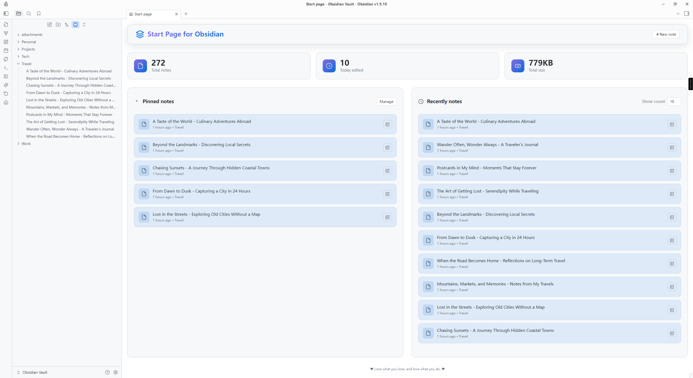
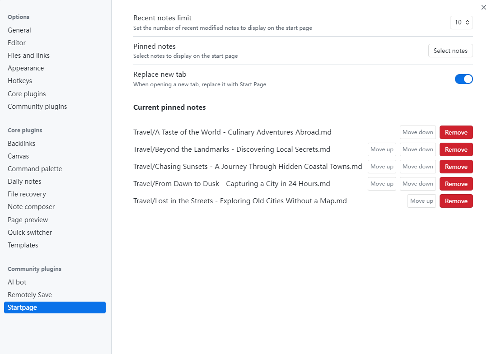

# StartPage Plugin

English | [中文](README.CN.md)

A modern startup homepage plugin for Obsidian that provides a beautiful dashboard interface, displaying vault statistics, pinned notes, and recently modified notes. Automatically displays a personalized homepage when starting Obsidian or opening new tabs, giving you quick access to important content.

## Features

### Smart Homepage
- **Automatic Startup Homepage**: Automatically opens a customized homepage when the plugin starts, with support for replacing new tabs
- **Modern Design**: Card-based layout with responsive design, perfectly adapted to various screen sizes
- **Dashboard Statistics**: Real-time display of vault statistics (total notes, today's edits, total storage space)
- **Quick Actions**: Built-in new note button for one-click note creation
- **Toolbar Integration**: Adds a homepage icon to the left toolbar for quick access anytime

### Note Management
- **Pinned Notes**: Set important notes to be displayed at the top of the homepage for quick access
- **Recent Notes**: Display a list of recently modified notes, sorted by modification time
- **Smart Search**: Support fuzzy search for selecting pinned notes
- **Dynamic Count**: Customizable number of recent notes to display (5-50 notes)
- **Context Menu**: Support adding/removing pinned notes via right-click context menu in file explorer

### User Experience
- **Smart Time Display**: Automatically shows relative time (minutes ago, hours ago, days ago)
- **Multi-language Support**: Supports both Chinese and English interfaces with dynamic switching
- **Real-time Refresh**: Automatically refreshes homepage content when files change
- **Timed Updates**: Notes modified within 24 hours will trigger periodic refresh (every minute)
- **Right-click Menu**: Supports right-click refresh functionality
- **Theme Adaptation**: Perfect adaptation to Obsidian's light and dark themes

## Installation

### Install from Obsidian Community Plugins

1. Open Obsidian Settings
2. Go to the "Community plugins" tab
3. Turn off "Safe mode"
4. Click the "Browse" button
5. Search for "StartPage"
6. Click install and enable the plugin

### Manual Installation

1. Download the latest version from the Releases page on GitHub.
2. Create a `.obsidian/plugins/obsidian-startpage/` folder in your Obsidian vault.
3. Copy the downloaded `main.js`, `styles.css`, and `manifest.json` files to this folder.
4. Restart Obsidian.
5. Enable the "Startpage" plugin in Settings → Community plugins.

## Screenshots

### Desktop Interface

#### Light Theme


*StartPage interface in light theme on desktop*



*Plugin settings interface in light theme*

#### Dark Theme


*StartPage interface in dark theme on desktop*


*Plugin settings interface in dark theme*

### Mobile Interface

#### Light Theme


*StartPage interface in light theme on mobile*


*Plugin settings interface in light theme on mobile*

#### Dark Theme


*StartPage interface in dark theme on mobile*


*Plugin settings interface in dark theme on mobile*

## Usage

### Basic Usage

1. **Open Start Page**: After installing and enabling the plugin, you can open the start page by:
   - Clicking the homepage icon in the left toolbar.
   - If "Replace new tab" is enabled, it will automatically display when opening new tabs.
2. **View Statistics**: The top of the homepage displays vault statistics (total notes, today's edits, total storage space).
3. **Quick Create**: Click the "New Note" button in the top right corner to quickly create a new note.
4. **Access Notes**: Click on pinned notes or recent notes to directly open the corresponding notes.
5. **Context Menu**: Right-click on files in the file explorer to quickly add or remove pinned notes.

### Setting Pinned Notes

1. Open Obsidian Settings.
2. Find the "StartPage" settings tab.
3. Click the "Select notes" button.
4. Enter note names in the popup search box for fuzzy search.
5. Select the notes to pin; they will be displayed in the "Pinned notes" section on the homepage.
6. Click the "Manage" button in the pinned notes area to quickly jump to the settings page.

### Custom Settings

- **Language Settings**: Choose between Chinese and English interface with dynamic switching.
- **Recent Notes Count**: Adjust the display count directly on the homepage (5-50 notes) or modify in settings.
- **Pinned Notes Management**: Add or remove pinned notes in the settings page.
- **Replace New Tab**: Option to automatically display the start page when opening new tabs.
- **Real-time Preview**: All setting changes take effect immediately on the homepage.

## Development

### Requirements

- Node.js 16.0 or higher
- Obsidian 1.8.7 or higher

### Local Development Setup

1.  **Clone the Repository**:
    ```bash
    git clone https://github.com/kuzzh/obsidian-startpage.git
    cd obsidian-startpage
    ```
2.  **Install Dependencies**:
    ```bash
    npm install
    ```
3.  **Set up the Obsidian Plugin Directory**:
    -   Rename the `env-example.json` file to `env.json`.
    -   Open `env.json` and modify the `OBSIDIAN_PLUGIN_DIR` value to the absolute path of your Obsidian vault's plugin directory. For example:
        ```json
        {
          "OBSIDIAN_PLUGIN_DIR": "D:\\Documents\\Obsidian\\.obsidian\\plugins\\obsidian-startpage"
        }
        ```
    -   This step ensures that the build artifacts are automatically synced to your vault for testing.
4.  **Start the Development Server**:
    ```bash
    npm run dev
    ```
    This command will watch for file changes, rebuild the plugin, and sync it to the directory specified in `env.json`.
5.  **Enable the Plugin in Obsidian**:
    -   Open Obsidian's settings.
    -   Go to "Community plugins".
    -   Make sure "Safe mode" is off.
    -   Find "Startpage" in the list of installed plugins and enable it.

### Build

To create a production build, run the following command:
```bash
npm run build
```

## Feature Details

### Dashboard Statistics

- **Total Notes**: Displays the count of all Markdown files in the vault.
- **Today's Edits**: Statistics of notes modified today.
- **Total Storage**: Shows the total size of all note files (automatically formatted as B/KB/MB/GB).
- **Real-time Updates**: Statistics data updates automatically with file changes.

### Note Display

- **Pinned Notes Section**:
  - Displays user-manually set important notes.
  - Supports unlimited pinned notes.
  - One-click management function to quickly jump to settings page.
- **Recent Notes Section**:
  - Displays recently edited notes sorted by modification time.
  - Supports dynamic adjustment of display count (5-50 notes).
  - Smart time display (relative and absolute time).

### Smart Refresh Mechanism

- **File Monitoring**: Automatically monitors file modification, creation, deletion, and rename events.
- **Timed Refresh**: Notes modified within 24 hours will trigger periodic refresh (every minute).
- **Manual Refresh**: Supports right-click menu manual refresh functionality.
- **Performance Optimization**: Intelligently determines whether refresh is needed to avoid unnecessary performance consumption.

### Multi-language Support

- **Bilingual Interface**: Complete support for Chinese and English interfaces.
- **Dynamic Switching**: Can switch languages in settings in real-time without restart.
- **Localized Display**: Time format, number format, etc. are fully localized.
- **Extensibility**: Architecture supports easy addition of more languages.

## Interface Features

### Modern Design
- **Card-based Layout**: Modern card design with clear information hierarchy.
- **Gradient Effects**: Beautiful gradient colors and shadow effects.
- **Responsive Design**: Perfect adaptation to desktop and mobile devices.
- **Theme Compatibility**: Automatically adapts to Obsidian's light and dark themes.

### Interactive Experience
- **Hover Effects**: Rich mouse hover animation effects.
- **Click Feedback**: Clear click feedback and state changes.
- **Keyboard Support**: Complete keyboard navigation support.
- **Accessibility**: Follows accessibility design principles.

## Technical Features

- **TypeScript Development**: Uses TypeScript to ensure code quality and type safety.
- **Modular Architecture**: Clear module separation for easy maintenance and extension.
- **Performance Optimization**: Smart caching and lazy loading for smooth experience.
- **Memory Management**: Automatic cleanup of timers and event listeners to avoid memory leaks.

## Contributing

Contributions are welcome! Please feel free to submit Issues and Pull Requests.

### Development Guide
1. Fork this repository.
2. Create a feature branch (`git checkout -b feature/AmazingFeature`).
3. Commit your changes (`git commit -m 'Add some AmazingFeature'`).
4. Push to the branch (`git push origin feature/AmazingFeature`).
5. Open a Pull Request.

## License

This project is licensed under the MIT License. See the [LICENSE](LICENSE) file for details.

## Acknowledgments

- Thanks to the Obsidian team for providing excellent plugin APIs and development framework.
- Thanks to all contributors and users for their feedback and support.